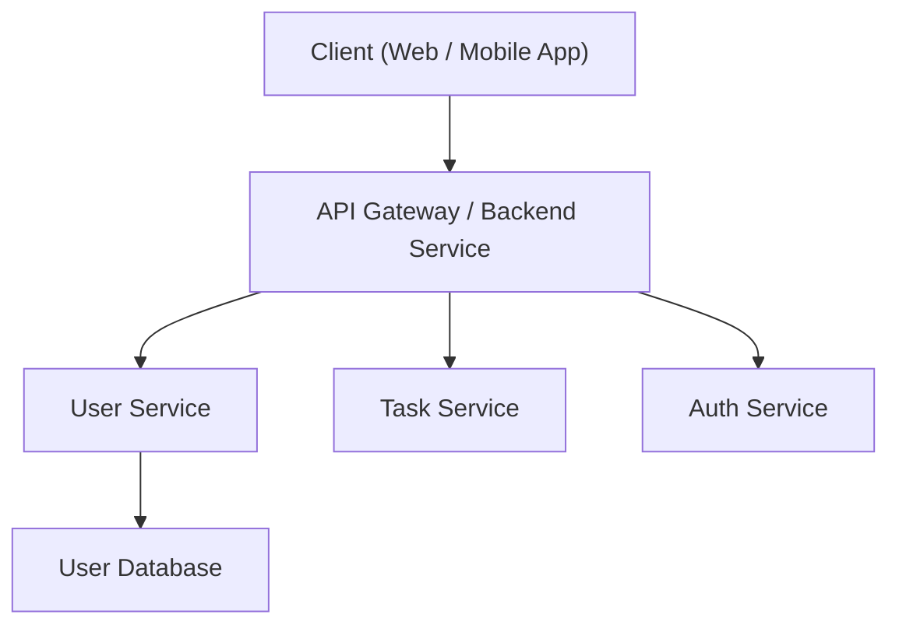

# System Architecture

This document provides an overview of the **Taskify system architecture**, describing how different components interact to deliver a secure, scalable, and maintainable application.

---

## Overview

Taskify adopts a **microservices architecture** to ensure scalability and flexibility.  
Each module handles a specific business domain and communicates securely through RESTful APIs managed by an **API Gateway**.

The client (web or mobile) interacts with the backend through this gateway, ensuring request routing, authentication, and service orchestration.

---

## Architecture Diagram

## Componen Description

| Component               | Description                                                                                                             |
| ----------------------- | ----------------------------------------------------------------------------------------------------------------------- |
| **Client (Web/Mobile)** | Frontend interface used by users to interact with the system. Built with React or Flutter.                              |
| **API Gateway**         | Central entry point that routes requests to respective services and handles authentication, rate limiting, and logging. |
| **User Service**        | Manages user profiles, roles, and permissions.                                                                          |
| **Task Service**        | Handles task creation, updates, and collaboration between users.                                                        |
| **Auth Service**        | Responsible for authentication, token generation, and session management using JWT.                                     |
| **Databases**           | Each service has its own database to ensure loose coupling and independent scaling.                                     |

## Data Flow Summary

- The client sends an API request to the API Gateway.
- The gateway validates authentication and forwards the request to the correct microservice.
- The service processes the request and interacts with its own database.
- The service returns the response through the gateway back to the client.